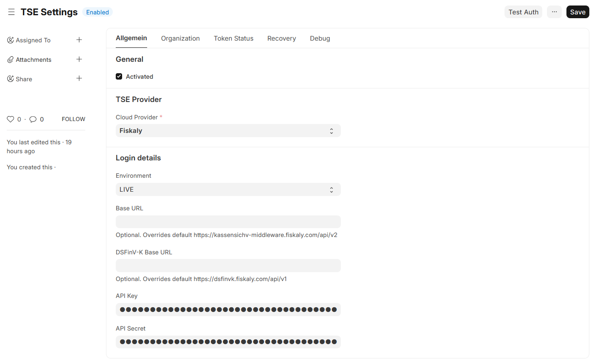
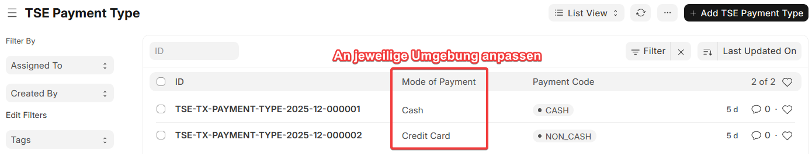
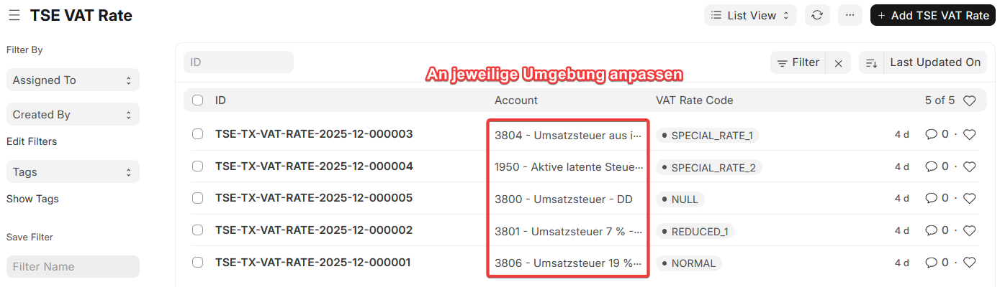
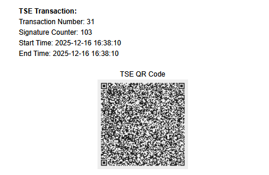

<div align="center">
  <p>
    
  </p>
    <h1>TSE ERPNext Integration</h1>
</div>


Diese App erweitert ERPNext um die Anbindung an eine Technische Sicherheitseinrichtung (TSE) und stellt die Grundlagen für gesetzeskonforme Kassenvorgänge in Deutschland bereit. 

Für die technische Umsetzung der TSE-Anbindung wird der Cloud-TSE-Anbieter [Fiskaly](https://www.fiskaly.com/) verwendet. Dadurch erfolgt die Verwaltung der TSE vollständig aus ERPNext heraus, während Fiskaly die gesetzeskonforme Signierung der Transaktionen gemäß KassenSichV übernimmt.

Somit ist es möglich Gesetzeskonform die POS-Oberfläche von ERPNext zu nutzen und hierbei die KassenSichV zu erfüllen.

## Supported Versions

| ERPNext | Frappe | Support-Status |
|---------|--------|----------------|
| v16 Beta    | v16 Beta   | ⚙️ Bald Verfügbar     |
| v15     | v15    | ✅ Unterstützt     |

## Installation (Frappe Cloud)

Die App kann direkt über die Frappe Cloud installiert werden:

1. Öffne das Frappe Cloud Dashboard unter <https://frappecloud.com/dashboard/#/sites>
2. Klicke auf **"New Site"**, um eine neue Instanz zu erstellen
3. Im Schritt **„Select apps to install“**:
   - Wähle die gewünschte Frappe-/ERPNext-Version aus  
   - Aktiviere zusätzlich die App **`ERPNEXT TSE`**
4. Schließlich den Assistenten abschließen bis die Seite erstellt wurde

## Installation (Self-Hosted)

Sobald ERPNext installiert ist wird die App mittels des folgenden Befehl zur Bench Umgebung hinzugefügt.

```bash
bench get-app https://github.com/Rocket-Quack/erpnext_tse.git --branch version-15
```

Anschließend kann die App für eine Seite installiert werden.
```bash
bench --site yoursite.com install-app erpnext_tse
```


## Kurz-Anleitungen

Detaillierte Anleitungen finden Sie hier:
- [TSE ERPNext Integration installieren](/docs/guides/de/installation.md)
- [Erstkonfiguration TSE in ERPNext](/docs/guides/de/configuration.md)
- [Nutzung der TSE in Produktion](/docs/guides/de/usage.md)

Diese Kurzübersciht zeigt, wie Sie die TSE-APP in ERPNext nutzen.

### Allgemeine Konfiguration
Bevor TSE-Security-Devices angelegt werden, muessen die globalen Einstellungen
und die fachlichen Mappings gesetzt werden. Ohne diese Basis ist keine
signierte POS-Transaktion moeglich.

#### **TSE Settings konfigurieren**

<p>
  
</p>

- In ERPNext das DocType `TSE Settings` oeffnen (Workspace: ERPNext TSE).
- `TSE Provider` auf **Fiskaly** setzen.
- `Environment` waehlen: **TEST** fuer erste Tests, **LIVE** fuer Produktion.
- `API Key` und `API Secret` aus dem fiskaly Dashboard eintragen.
- `Base URL` und `DSFinV-K Base URL` nur anpassen, falls bewusst abweichend.
- `Activated` aktivieren, speichern und danach ueber **Test TSE Auth** die Verbindung pruefen.
- Pruefen, ob `Organization ID`, Token-Status und Environment gesetzt werden.

#### **Steuer- und Zahlungsarten mappen**

<p>
  
</p>

- `TSE Payment Type`: `CASH` und `NON_CASH` den ERPNext-Zahlungsarten
  (Mode of Payment) zuordnen.

<p>
  
</p>

- `TSE VAT Rate`: vorhandene VAT-Codes mit den passenden Steuerkonten verknuepfen
  (Account Type = Tax). Aktuell werden 19% und 7% verarbeitet.

Wenn diese Schritte abgeschlossen sind, kann die eigentliche TSE-Konfiguration
(Security Device, Clients, POS-Profile) gestartet werden.
Details: [Erstkonfiguration TSE in ERPNext](/docs/guides/de/configuration.md)

### TSE Konfigurationen

In diesem Schritt wird die eigentliche TSE Security Device angelegt.  
Auf dieser TSE werden später die einzelnen Kassen-Clients ihre elektronischen Transaktionen buchen.

<p>
  
</p>

Damit wird die komplette Lebensdauer der TSE von der Erstellung bis zur Deaktivierung direkt aus ERPNext heraus gesteuert.  
Es ist hierbei keine manuelle Pflege in Fiskaly nötig.

Zusätzlich werden alle Status-Änderungen zur Einsicht des Nutzers Dokumentiert und in einem eigenen Provider Response Protokoll gespeichert.

<p>
  
</p>

### POS-Profile Einstellungen
Jedes POS-Profile muss genau einem TSE Client zugeordnet sein (1:1).
Der TSE Client wird wiederum einem TSE Security Device zugewiesen.

**Vorgehen**
- Im DocType `TSE Client` einen neuen Client anlegen und ein `TSE Security Device`
  auswaehlen.
- Im selben Dokument das gewuenschte `POS Profile` setzen.
- Das Feld `TSE Client` im POS Profile wird dabei automatisch gepflegt. Pruefe,
  dass der Link gesetzt ist.

Details: [Erstkonfiguration TSE in ERPNext](/docs/guides/de/configuration.md)

### Signierte POS-Belege
Nach dem Absenden einer POS Invoice startet die App automatisch die
TSE-Transaktion und beendet sie mit den Transaktionsdaten.

**Woran erkenne ich eine erfolgreiche Signatur**
- In der POS Invoice ist das Feld `TSE Transaction` gefuellt.
- Im verknuepften Dokument sind Status, Signaturdaten und `qr_code_data` sichtbar.
- Beim Druck das Print Format **POS Invoice TSE** verwenden (siehe unten).

Details: [Nutzung der TSE in Produktion](/docs/guides/de/usage.md)

### Print Format

Das Print Format "POS Invoice TSE" erweitert den Standard-POS-Beleg um die rechtlich relevanten TSE-Daten. Am Belegende wird ein QR-Code angezeigt, der aus dem Feld `qr_code_data` der verknüpften TSE-Transaktion erzeugt wird und die signierten Informationen enthält. 
Zusätzlich werden die in der TSE-Transaktion gespeicherten Daten ausgegeben:
- `transaction_number`
- `signature_counter`
- `start_time`
- `end_time`

<p>
  
</p>

Dadurch sind sowohl der QR-Code als auch die zugehörigen Signatur- und Transaktionsdaten direkt auf dem Beleg.
Rechtlich gesehen reicht auch nur der QR-Code zur Anageb der TSE Transaktion.

## Support & Inbetriebnahme

### Community-Support (kostenlos)
- **Bug Reports & Feature Requests:** 
- **Fragen zur Allgemeinen Nutzung:**

Bitte über die [Issues](https://github.com/Rocket-Quack/erpnext_tse/issues) ein Ticket erstellen

### Erweiterte Unterstützung (optional / kommerziell)
Kommerzielle Unterstützung ist optional und richtet sich an besondere
Anforderungen oder komplexere Setups.  

In den meisten Fällen ist keine kommerzielle Unterstützung erforderlich.
Die App ist so konzipiert, dass Installation, Konfiguration und Betrieb
mit der bereitgestellten Dokumentation selbstständig leicht möglich sein sollte.

Für Unterstützung die dennoch gewünscht ist, z. B. bei:
- Installation, Inbetriebnahme und Konfiguration
- Troubleshooting in produktionsnahen Setups
- Anpassungen / Integrationen

können Anfragen über das Kontaktformular gestellt werden:  
🦆 [Quack Senden](https://rocket-quack.github.io/website/contact-erpnext-tse) 🦆

## Sponsoren ❤️

Die Entwicklung und Wartung wird durch Sponsoren und freiwillige Unterstützung ermöglicht. 

Ein besonderer Dank geht hierbei an die folgenden Unterstützer:

<a href="https://puzzles-shisha.de/" target=_blank></a>

Wer das Projekt unterstützen möchte, kann dies gerne über
[Ko-fi](https://ko-fi.com/rocketquack) tun.


Hinweis: Sponsoren und Unterstützer haben keinen Einfluss auf Funktionalität, Roadmap oder Quellcode.

## License

Copyright (C) 2025 RocketQuackIT

This program is free software: you can redistribute it and/or modify it under the terms of the GNU General Public License as published by the Free Software Foundation, either version 3 of the License, or (at your option) any later version.

This program is distributed in the hope that it will be useful, but WITHOUT ANY WARRANTY; without even the implied warranty of MERCHANTABILITY or FITNESS FOR A PARTICULAR PURPOSE. See the GNU General Public License for more details.

GNU GPL V3. See the `LICENSE` file for more information.
