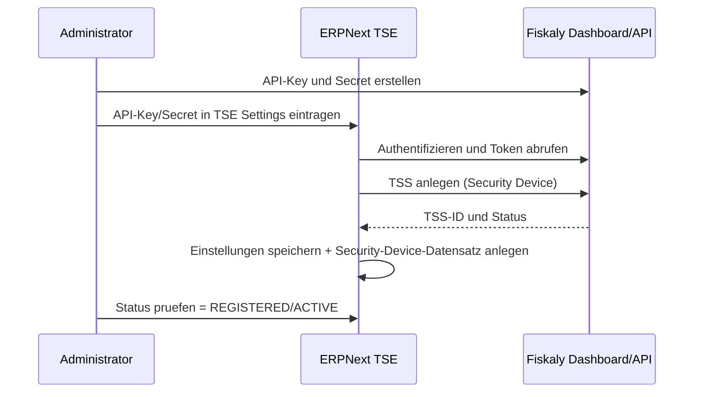
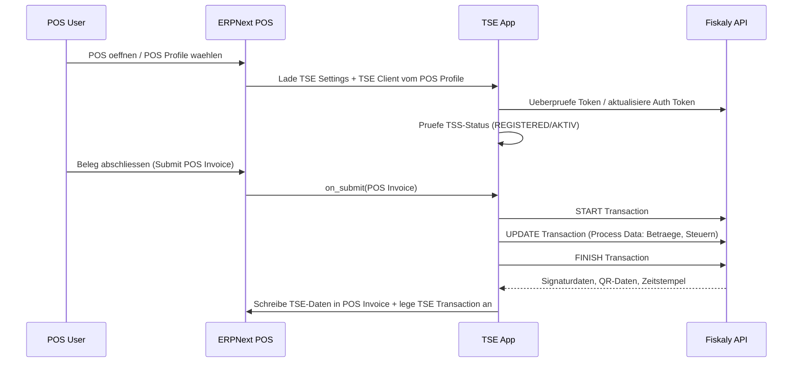
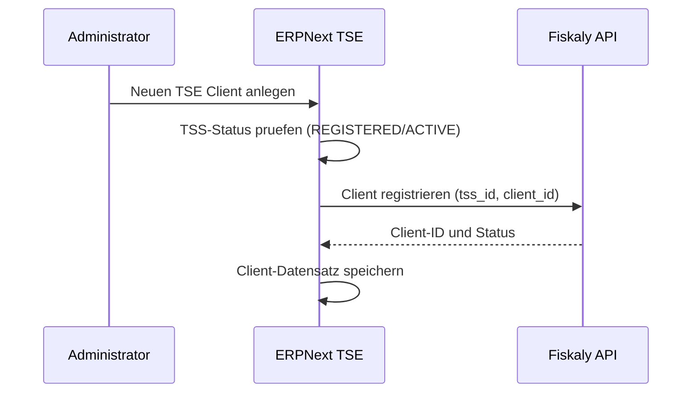
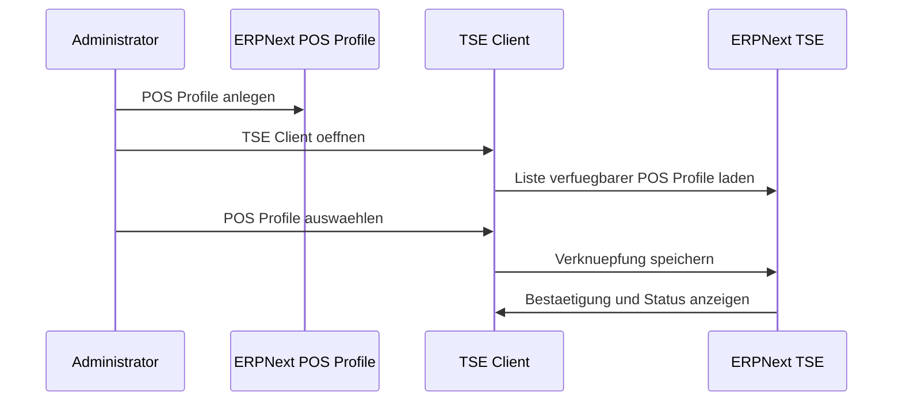
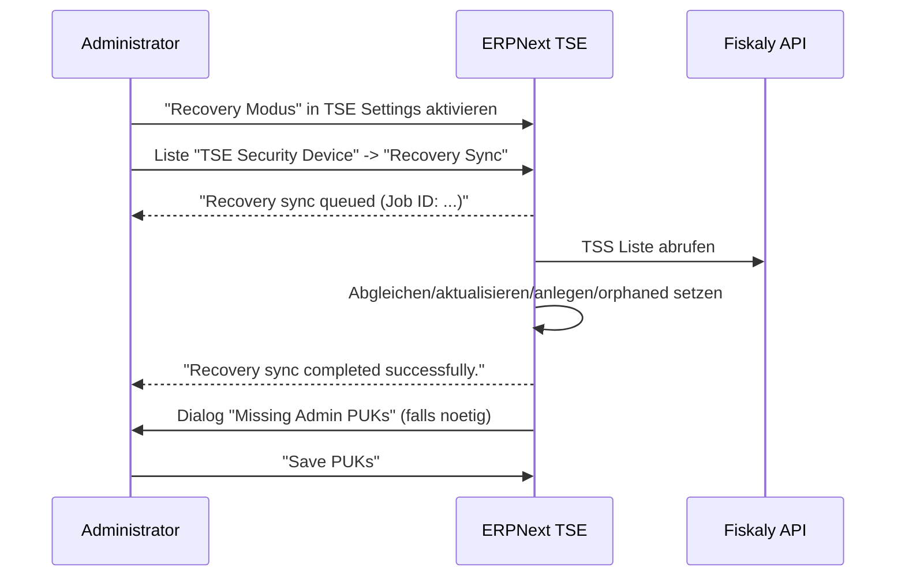
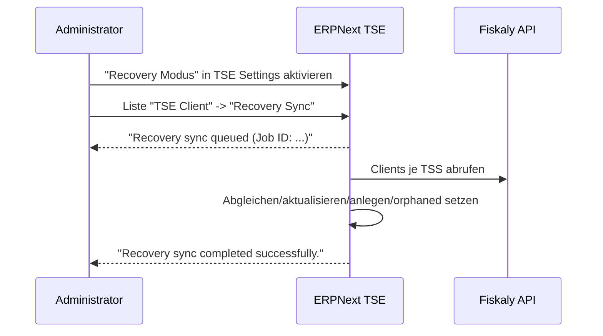
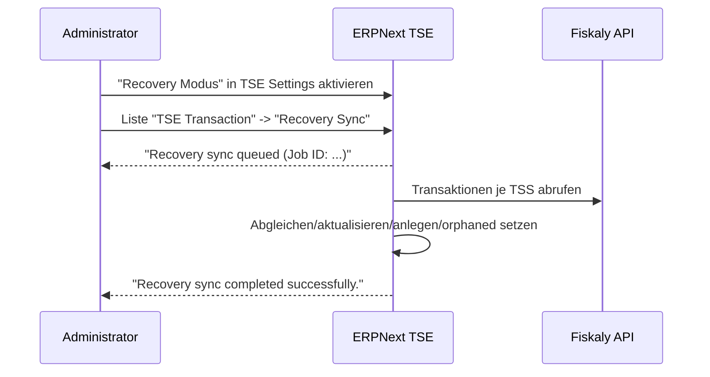

# Erstkonfiguration der Fiskaly-TSE

# Ablauf POS-Rechnung

# Clients fuer TSE anlegen

# POS Profile verknuepfen

Kurzbeschreibung:
- POS Profile fachlich zuerst anlegen.
- Im TSE Client das passende POS Profile auswaehlen und speichern.
- Die Verknuepfung ist notwendig, damit Verkaeufe signiert werden koennen.

# Recovery-Sync fuer Security Devices (TSE)

Kurzbeschreibung:
- In **TSE Settings** den Schalter **Recovery Modus** aktivieren.
- In der Liste **TSE Security Device** den Button **Recovery Sync** starten (nur im Recovery Modus sichtbar).
- Meldungen: "Recovery sync queued (Job ID: ...)" beim Start, danach "Recovery sync completed successfully."
- Abgleich der TSS: lokale Eintraege aktualisieren/neu anlegen, nicht gefundene auf `ORPHANED` setzen.
- Fehlt ein Admin PUK, erscheint der Dialog **Missing Admin PUKs** mit Aktion **Save PUKs**.

# Recovery-Sync fuer TSE Clients

Kurzbeschreibung:
- In **TSE Settings** den Schalter **Recovery Modus** aktivieren.
- In der Liste **TSE Client** den Button **Recovery Sync** starten (nur im Recovery Modus sichtbar).
- Meldung nach Abschluss: "Recovery sync completed successfully."
- Abgleich der Clients je TSS: lokal matchen, aktualisieren/neu anlegen, fehlende auf `ORPHANED` setzen.

# Recovery-Sync fuer TSE Transaktionen

Kurzbeschreibung:
- In **TSE Settings** den Schalter **Recovery Modus** aktivieren.
- In der Liste **TSE Transaction** den Button **Recovery Sync** starten (nur im Recovery Modus sichtbar).
- Meldung nach Abschluss: "Recovery sync completed successfully."
- Abgleich der Transaktionen je TSS: lokal matchen, aktualisieren/neu anlegen, fehlende auf `ORPHANED` setzen.
- Empfehlung: erst TSE Clients recovern, damit Client-Links korrekt gesetzt werden koennen.

