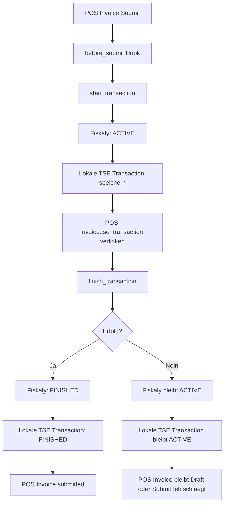
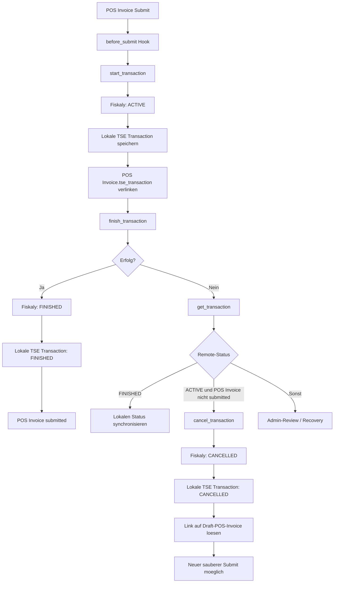

# TSE Transaction ACTIVE: Fehlerbehandlung und Recovery

## Ziel
Dieses Dokument beschreibt den normalen Ablauf einer TSE Transaction fuer `POS Invoice`, den moeglichen Fehlerpfad mit einer bei Fiskaly haengenden `ACTIVE`-Transaction und die dazugehoerige Recovery-Strategie in der App.

Der normale fachliche Checkout bleibt unveraendert:
- Transaktion bei Fiskaly starten
- Transaktion nach erfolgreichem Vorgang finalisieren
- POS Invoice nur mit finaler TSE-Transaction submitten

Ergaenzt wird nur die Fehlerbehandlung fuer den Fall, dass zwischen `start_transaction` und `finish_transaction` etwas schiefgeht.

## Normaler Ablauf
1. Benutzer klickt **Submit** auf der `POS Invoice`.
2. Der Hook `POS Invoice.before_submit` startet die TSE-Transaction bei Fiskaly.
3. Fiskaly setzt den Transaktionsstatus auf `ACTIVE`.
4. Die App fuehrt direkt danach `finish_transaction` aus.
5. Fiskaly setzt den Status auf `FINISHED`.
6. Die lokale `TSE Transaction` wird aktualisiert und die `POS Invoice` wird submitted.

## Warum ein ACTIVE haengen bleiben kann
Der technische Zwischenzustand `ACTIVE` ist fachlich normal. Problematisch wird es nur, wenn zwischen Start und Finish ein Fehler auftritt:
- Timeout oder HTTP-Fehler
- Prozessabbruch
- lokale Exception nach erfolgreichem Start

In diesem Fall existiert bei Fiskaly bereits eine offene `ACTIVE`-Transaction, obwohl die `POS Invoice` lokal noch nicht sauber abgeschlossen ist.

## Bisheriger Ablauf

## Verbesserter Ablauf
Der Erfolgsfall bleibt identisch. Nur der Fehlerpfad wird gehaertet:
- nach einem Fehler wird der Remote-Status aktiv geprueft
- falls Fiskaly bereits `FINISHED` ist, wird nur lokal synchronisiert
- falls Fiskaly noch `ACTIVE` ist und die verknuepfte `POS Invoice` nicht submitted wurde, wird die Transaction kontrolliert auf `CANCELLED` gesetzt
- danach kann die `POS Invoice` sauber neu submitted werden

## Verhalten des Fixes
- Der normale `ACTIVE -> FINISHED`-Checkout wird nicht geaendert.
- Es wird keine automatische Hintergrund-Storno-Logik fuer beliebige alte Transactions eingefuehrt.
- Der neue Pfad greift nur dann, wenn die App selbst im Start/Finish-Fenster scheitert oder ein Admin eine haengende `ACTIVE`-Transaction gezielt bereinigt.

## Admin-Repair fuer haengende ACTIVE Transactions
Auf `TSE Transaction` stehen fuer `System Manager` und `TSE Admin` zwei Aktionen zur Verfuegung:

- `Refresh Status`
  - liest den aktuellen Fiskaly-Status
  - synchronisiert den lokalen Datensatz

- `Resolve ACTIVE`
  - prueft den Remote-Status erneut
  - cancelt nur dann, wenn Fiskaly noch `ACTIVE` meldet
  - cancelt nicht, wenn die verknuepfte `POS Invoice` bereits submitted ist
  - loest bei erfolgreichem `CANCELLED` den Link auf der Draft-`POS Invoice`

## Entscheidungshilfe

- `POS Invoice` ist noch Draft und Remote-Status ist `ACTIVE`
  - `Resolve ACTIVE` ist der richtige Weg
- `POS Invoice` ist submitted und Remote-Status ist `FINISHED`
  - nur synchronisieren, nicht canceln
- Status lokal unklar oder fachlicher Vorgang widerspruechlich
  - kein Automatismus, sondern Admin-Review

## Wichtige Hinweise
- Eine `ACTIVE`-Transaction wird nicht automatisch per Timeout von Fiskaly beendet.
- Eine Draft-`POS Invoice` mit haengender `ACTIVE`-Transaction darf nicht durch ein blindes `finish_transaction` repariert werden.
- Das Feld `POS Invoice.tse_transaction` ist nur technisch und sollte nicht manuell gepflegt oder kopiert werden.

## Quellen und Einordnung
- Fiskaly beschreibt den normalen Checkout mit `ACTIVE` und `FINISHED`.
- Fiskaly beschreibt fuer abgebrochene Vorgange direkt nach Start den Zielstatus `CANCELLED`.
- Die App bildet diese Logik ab und ergaenzt nur die Fehlerbehandlung fuer technische Zwischenfaelle.
