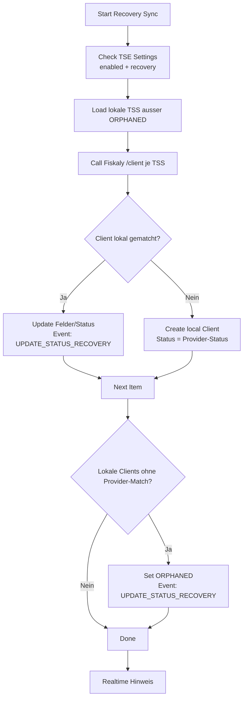

# Recovery-Sync fuer TSE Clients (Fiskaly)

## Ziel
Der Recovery-Sync laedt alle Clients je TSS bei Fiskaly, gleicht sie mit lokalen TSE Clients ab, legt fehlende Eintraege an und markiert Inkonsistenzen. Damit kann eine Umgebung nach einem Desaster oder nach manuellen Aenderungen beim Provider wieder konsistent werden.

## Voraussetzungen
- TSE Settings: `Aktiviert` und `Recovery Modus` aktiv.
- Fiskaly-Zugangsdaten gueltig (API Key/Secret, gueltiges Token).
- Hintergrundjobs (RQ) laufen.

## Ablauf im UI
1) Oeffne die Liste **TSE Client**.  
2) Klicke auf **Recovery Sync** (Button erscheint nur, wenn Recovery Modus aktiv ist).  
3) Der Job wird in der Long-Queue eingeplant und laeuft asynchron.  
4) Bei Abschluss erscheint ein Realtime-Hinweis: "Recovery sync completed successfully."  

## Was der Job macht
- Ruft fuer jede lokale TSS (ausser ORPHANED) `GET /tss/{tss_id}/client` ab.
- Matcht Provider-Clients gegen lokale Eintraege in dieser Reihenfolge:
  - `client_id`
  - `metadata.tse_client_docname`
  - `metadata.tse_client_name` / `metadata.client_name` / `metadata.name`
  - `metadata.pos_profile` / `metadata.pos_profile_name`
- Aktualisiert bei Match u. a. Status, `client_id`, `serial_number`, `tse_security_device`, `company`, `pos_profile` (nur wenn frei).
- Legt fehlende Clients an und uebernimmt Provider-Status.
- Markiert lokale Clients ohne Provider-Match als `ORPHANED`.
- Schreibt pro Eintrag ein Provider-Event (`UPDATE_STATUS_RECOVERY`).

## Wichtige Hinweise
- Recovery-Sync aktualisiert nur lokale Daten und aendert keine Provider-Daten.
- Recovery ueberschreibt keine POS Profile, die bereits an einen anderen Client gebunden sind (Unique-Constraint).
- ORPHANED bedeutet: Client wurde beim Provider nicht gefunden und muss geprueft werden.
- Realtime-Event: `tse_client_recovery_done`
- Job-ID: `tse_client_recovery_sync`

## Mermaid-Uebersicht (Recovery)

