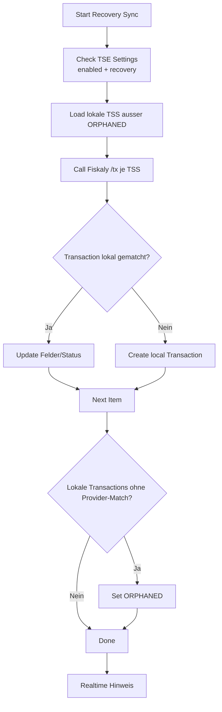

# Recovery-Sync fuer TSE Transaktionen (Fiskaly)

## Ziel
Der Recovery-Sync laedt alle Transaktionen je TSS bei Fiskaly, gleicht sie mit lokalen TSE Transactions ab, legt fehlende Eintraege an und markiert Inkonsistenzen. Damit kann eine Umgebung nach einem Desaster oder nach manuellen Aenderungen beim Provider wieder konsistent werden.

## Voraussetzungen
- TSE Settings: `Aktiviert` und `Recovery Modus` aktiv.
- Fiskaly-Zugangsdaten gueltig (API Key/Secret, gueltiges Token).
- Hintergrundjobs (RQ) laufen.

## Ablauf im UI
1) Oeffne die Liste **TSE Transaction**.  
2) Klicke auf **Recovery Sync** (Button erscheint nur, wenn Recovery Modus aktiv ist).  
3) Der Job wird in der Long-Queue eingeplant und laeuft asynchron.  
4) Bei Abschluss erscheint ein Realtime-Hinweis: "Recovery sync completed successfully."  

## Was der Job macht
- Ruft fuer jede lokale TSS (ausser ORPHANED) `GET /tss/{tss_id}/tx` ab (paginiert).
- Sortiert die Provider-Transaktionen je TSS nach `time_start` (aufsteigend) und `transaction_number`.
- Matcht Provider-Transaktionen ueber `transaction_id`.
- Aktualisiert bei Match u. a. Status, Revision, Nummer, Signaturzaehler, Zeiten, QR-Daten und `tse_security_device` sowie Client/Company-Link.
- Legt fehlende Transaktionen lokal an und uebernimmt Provider-Status.
- Setzt `docstatus=1` fuer `FINISHED` oder `CANCELLED` Transaktionen.
- Markiert lokale Transaktionen ohne Provider-Match als `ORPHANED`.

## Wichtige Hinweise
- Recovery-Sync aktualisiert nur lokale Daten und aendert keine Provider-Daten.
- Empfehlung: zuerst **TSE Clients** recovern, damit Client-Links korrekt gesetzt werden koennen.
- Recovery aendert keine POS Invoice und erstellt keine neuen POS Belege.
- Transaktionen ohne `transaction_id` werden uebersprungen.
- Realtime-Event: `tse_transaction_recovery_done`
- Job-ID: `tse_transaction_recovery_sync`

## Mermaid-Uebersicht (Recovery)

