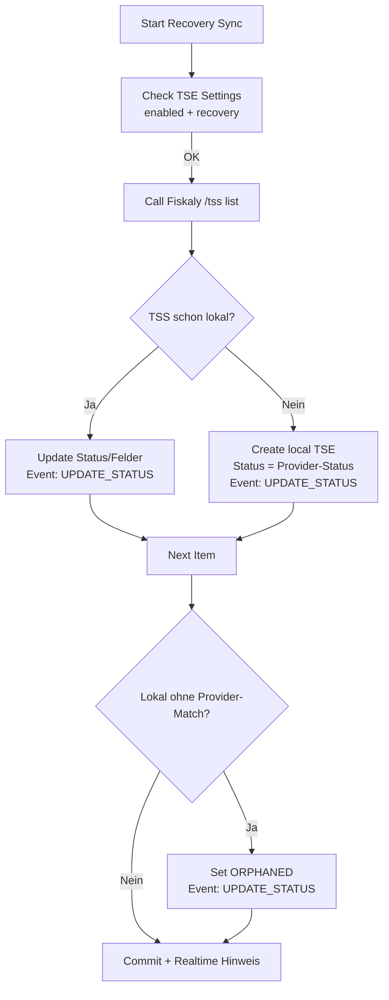

# Recovery-Sync fÜr TSE Security Devices (Fiskaly)

## Ziel
Der Recovery-Sync holt alle TSS bei Fiskaly ab, gleicht sie mit den lokalen TSE Security Devices ab, legt fehlende Einträge an und markiert Inkonsistenzen. Damit lassen sich Umgebungen nach einem Desaster oder nach manuellen Änderungen beim Provider wieder konsistent herstellen.

## Voraussetzungen
- TSE Settings: `Aktiviert` und `Recovery Modus` aktiviert.
- Fiskaly-Zugangsdaten gültig (API Key/Secret, gültiges Token).
- Hintergrundjobs (RQ) laufen.

## Ablauf im UI
1) Öffne die Liste **TSE Security Device**.  
2) Klick auf **Recovery Sync** (Button erscheint nur, wenn Recovery Modus aktiv ist).  
3) Der Job wird in der Long-Queue eingeplant und läuft asynchron.  
4) Bei Abschluss erscheint ein Realtime-Hinweis: „Recovery sync completed successfully.“

## Was der Job macht
- Ruft `GET /tss` bei Fiskaly auf.
- Mapped die Provider-States auf lokale Status:
  - `CREATED` → `CREATED`
  - `UNINITIALIZED` → `UNINITIALIZED`
  - `INITIALIZED` → `INITIALIZED`
  - `DELETED` → `DISABLED`
  - unbekannte → `ERROR`
- Für bestehende Devices mit gleicher `tss_id`:
  - Aktualisiert Status, Seriennummer, Zeitstempel (`time_init`/`time_disable`), Admin PUK (falls geliefert und lokal leer).
  - Schreibt ein Provider Event (`UPDATE_STATUS`, action `recovery_sync`) mit Status vor/nach und Provider-Response in die Child-Tabelle.
- Für lokale Devices ohne Treffer beim Provider:
  - Status wird auf `ORPHANED` gesetzt, Event mit Hinweis „TSS missing at provider“.
- Für Provider-TSS ohne lokalen Eintrag:
  - Legt ein neues TSE Security Device mit Provider-Status an (kein Zurücksetzen auf DRAFT).
  - Event mit voller Provider-Response.

## Wichtige Hinweise
- Der Admin PUK ist nur beim Anlegen der TSS verfügbar. Recovery kann den PUK nicht nachträglich von Fiskaly holen. Sicher extern speichern!
- Beim Deaktivieren einer TSS werden vorab alle verknüpften TSE Clients automatisch auf `DEREGISTERED` gesetzt, damit spätere Aktionen nicht blockieren.
- Fehler im Job werden ins Error Log geschrieben; der Job selbst schlägt dann fehl.

## Mermaid-Übersicht

## Fehlerbehebung
- 401 `E_ADMIN_NOT_AUTHENTICATED` bei Client/TSS-Operationen: Admin-PIN/PUK prüfen; sicherstellen, dass Admin-Auth im jeweiligen Flow erfolgt.
- Datumsfehler (`Incorrect datetime value`): Stammen von ungeparsten Unix-Zeitstempeln; die Recovery-Logik konvertiert sie automatisch. Falls weiterhin sichtbar, Daten prüfen.

## Felder, die aktualisiert werden
- `tss_status` (gemäß Mapping)
- `tss_serial_number`
- `activated_at` (time_init)
- `deactivated_at` (time_disable)
- `admin_puk` (nur wenn lokal leer und Provider liefert einen Wert)
