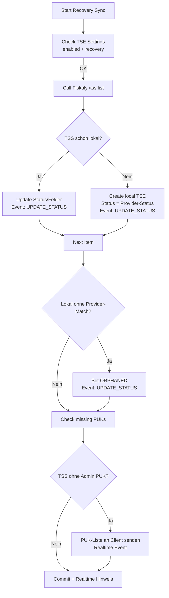
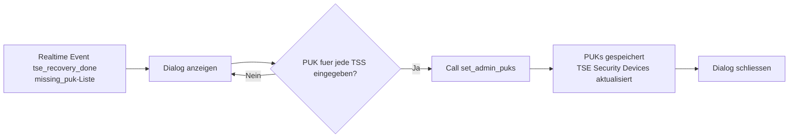

# Recovery-Sync fuer TSE Security Devices (Fiskaly)

## Ziel
Der Recovery-Sync holt alle TSS bei Fiskaly ab, gleicht sie mit lokalen TSE Security Devices ab, legt fehlende Eintraege an und markiert Inkonsistenzen. So kann eine Umgebung nach einem Desaster oder nach manuellen Aenderungen beim Provider wieder konsistent werden.

## Voraussetzungen
- TSE Settings: `Aktiviert` und `Recovery Modus` aktiv.
- Fiskaly-Zugangsdaten gueltig (API Key/Secret, gueltiges Token).
- Hintergrundjobs (RQ) laufen.

## Ablauf im UI
1) Oeffne die Liste **TSE Security Device**.  
2) Klicke auf **Recovery Sync** (Button erscheint nur, wenn Recovery Modus aktiv ist).  
3) Der Job wird in der Long-Queue eingeplant und laeuft asynchron.  
4) Bei Abschluss erscheint ein Realtime-Hinweis: „Recovery sync completed successfully.“  
5) Falls TSS ohne Admin PUK gefunden werden (Status >= CREATED, kein `admin_puk` hinterlegt), oeffnet sich ein Dialog, in dem fuer jede TSS der Admin PUK manuell eingetragen und gespeichert werden muss. Die PUKs werden danach in den jeweiligen TSE Security Devices abgelegt.

## Was der Job macht
- Ruft `GET /tss` bei Fiskaly auf.
- Mappt Provider-States auf lokale Status:
  - `CREATED` -> `CREATED`
  - `UNINITIALIZED` -> `UNINITIALIZED`
  - `INITIALIZED` -> `INITIALIZED`
  - `DELETED` -> `DISABLED`
  - unbekannte -> `ERROR`
- Fuer bestehende Devices mit gleicher `tss_id`:
  - Aktualisiert Status, Seriennummer, Zeitstempel (`time_init`/`time_disable`), Admin PUK (falls geliefert und lokal leer).
  - Schreibt ein Provider Event (`UPDATE_STATUS`, Action `recovery_sync`) mit Status vor/nach und Provider-Response in die Child-Tabelle.
- Fuer lokale Devices ohne Treffer beim Provider:
  - Status wird auf `ORPHANED` gesetzt, Event mit Hinweis „TSS missing at provider“.
- Fuer Provider-TSS ohne lokalen Eintrag:
  - Legt ein neues TSE Security Device mit Provider-Status an (kein Zuruecksetzen auf DRAFT).
  - Event mit voller Provider-Response.
- Sammeln aller TSS (Status >= CREATED) ohne Admin PUK -> diese werden im Abschlussdialog abgefragt.

## Wichtige Hinweise
- Der Admin PUK ist nur beim Anlegen der TSS verfuegbar. Recovery kann den PUK nicht nachtraeglich von Fiskaly holen. Sicher extern speichern!
- Beim Deaktivieren einer TSS werden vorab alle verknuepften TSE Clients automatisch auf `DEREGISTERED` gesetzt, damit spaetere Aktionen nicht blockieren.
- Fehler im Job werden ins Error Log geschrieben; der Job selbst schlaegt dann fehl.
- Nach dem Recovery erscheint bei Bedarf ein Dialog zur Nachpflege von Admin PUKs (Status >= CREATED, kein `admin_puk`). Ohne Pflege bleibt das Feld leer und muss manuell befuellt werden.

## Mermaid-Uebersicht (Recovery)

## Mermaid-Uebersicht (PUK-Dialog)

## Fehlerbehebung
- 401 `E_ADMIN_NOT_AUTHENTICATED` bei Client/TSS-Operationen: Admin-PIN/PUK pruefen; sicherstellen, dass Admin-Auth im jeweiligen Flow erfolgt.
- Datumsfehler (`Incorrect datetime value`): stammen von ungeparsten Unix-Zeitstempeln; die Recovery-Logik konvertiert sie automatisch. Falls weiterhin sichtbar, Daten pruefen.

## Felder, die aktualisiert werden
- `tss_status` (gemaess Mapping)
- `tss_serial_number`
- `activated_at` (time_init)
- `deactivated_at` (time_disable)
- `admin_puk` (nur wenn lokal leer und Provider liefert einen Wert; fehlende werden nach Recovery per Dialog vom Nutzer nachgepflegt)
